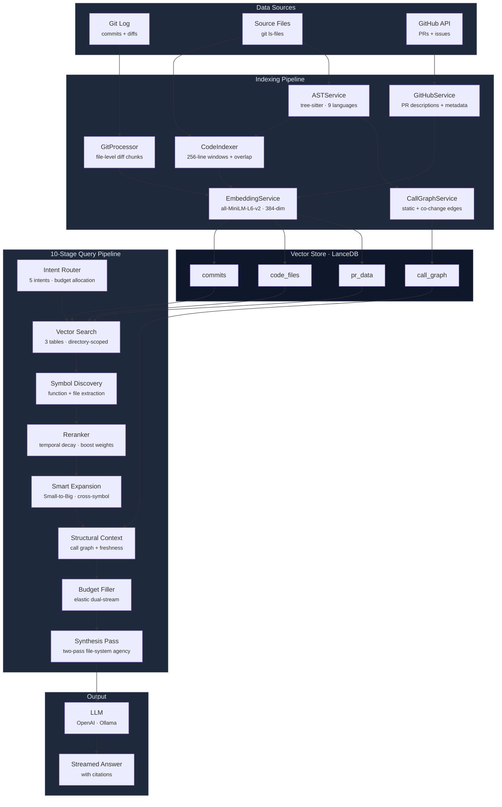
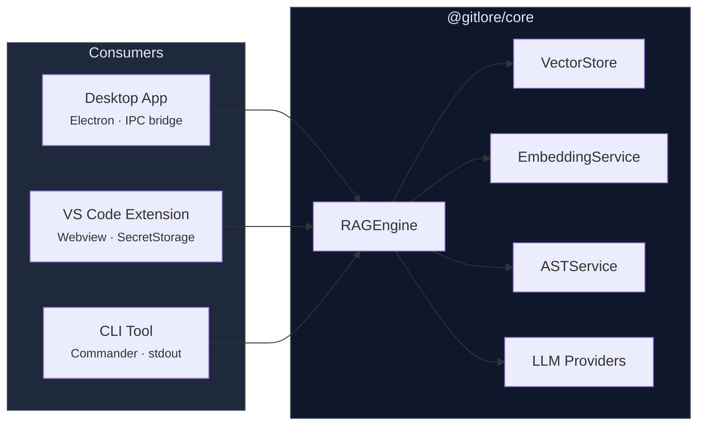

<div align="center">

# GitLore

**RAG-powered intelligence for Git repositories**

Chat with your codebase, commit history, and pull requests — backed by local embeddings, AST-aware chunking, and a 10-stage retrieval pipeline.

[](https://www.typescriptlang.org/)
[](https://www.electronjs.org/)
[](https://react.dev/)
[](https://lancedb.com/)
[](LICENSE)

[Getting Started](#getting-started) · [How It Works](#how-it-works) · [Architecture](#architecture) · [CLI Reference](#cli-reference) · [Validation](#battle-tested-expressjs-stress-tests)

</div>

---

## Why GitLore?

Your repository already contains the answers — buried in thousands of commits, PR discussions, and code changes that no one remembers. GitLore makes that institutional knowledge queryable.

**Understand the "why" behind every decision.** A codebase isn't just what the code does today — it's the history of every choice that shaped it. GitLore indexes your entire repository (commits, source files, PRs) into a local vector database so you can ask:

- **"Why does this function exist?"** → Surfaces the original commit, the PR discussion, and the problem it was solving
- **"Why did the team choose Redis over Memcached?"** → Finds the PR where the decision was debated and the commit where it was implemented
- **"Who built the payment flow and who should I ask about it?"** → Identifies the authors, reviewers, and most recent contributors
- **"What broke in the last deploy?"** → Flips to 80% commit history retrieval and traces the regression
- **"How does the auth middleware work?"** → Traces the call chain across files with `file:line` references

### Onboard developers in hours, not weeks

New team members don't need to reverse-engineer the codebase or interrupt senior devs. They can ask GitLore why a module is structured a certain way, who owns which subsystem, and what the original design intent was — all backed by actual commits and PR conversations, not tribal knowledge.

### Context distillation — make every LLM token count

When you paste code into Claude or GPT, you're spending tokens on context that may not matter. GitLore's 10-stage retrieval pipeline acts as a **context distillation layer**: it classifies your question's intent, searches across three data streams (code, commits, PRs), reranks by relevance, and delivers only the most targeted snippets to the LLM. Every token in the prompt is code and history that actually matters to your specific query — not a raw file dump.

**Privacy-first:** Embeddings and vector search run entirely on your machine. Only the final distilled context is sent to the LLM.

### Key Engineering Decisions

| Problem | Solution |
|---------|----------|
| Standard RAG loses context across file boundaries | **10-stage retrieval pipeline** with cross-symbol expansion, anchor file persistence, and two-pass file-system agency |
| 256-line chunks miss function closures | **AST-aware chunking** with parent-function detection via tree-sitter (9 languages) |
| "When was X changed?" retrieves irrelevant code | **Intent classification** (5 intents) dynamically allocates budget between code and commit streams |
| Old commits pollute results for "how does X work?" | **Temporal reranking** with intent-specific recency decay and anchor-based proximity scoring |
| Large repos (10K+ commits) are too slow | **HNSW-SQ indices**, directory-scoped search, paged processing with constant memory |
| LLM answers lack traceability | **Mandatory code-flow format** with numbered call chains and `file:line` citations |
| Pasting raw files wastes LLM tokens on irrelevant code | **Context distillation** — intent-aware retrieval delivers only the snippets that matter |

---

## How It Works



### The Four Data Streams

| Stream | Source | What's Indexed | Example Queries |
|--------|--------|----------------|----------|
| **Commits** | `git log` + diffs | Per-file diff chunks with author, date, message | "When was X changed?", "Who added this?" |
| **Code** | `git ls-files` | 256-line chunks with AST metadata (functions, classes, imports) | "How does auth work?", "Where is X defined?" |
| **PRs** | GitHub API | Descriptions, linked issues, merge status, reviewers | "What was the goal of this feature?" |
| **Structure** | tree-sitter AST | Static call edges, co-change coupling, freshness labels | "What calls this function?" |

---

## Getting Started

### Desktop App (Electron)

```bash
git clone https://github.com/ami3g/GitLore.git
cd GitLore
npm install
npm run -w @gitlore/core build
cd packages/desktop
npm run dev
```

1. Configure your LLM provider in **Settings** (OpenAI or Ollama)
2. Open **Index** → select a repository → run the indexing pipeline
3. Ask questions in **Ask** — answers stream in with adjustable TopK
4. Generate diagrams in **Diagrams** — architecture, call graph, commit timeline, PR flow

### VS Code Extension

```bash
git clone https://github.com/ami3g/GitLore.git
cd GitLore
npm install
npm run compile
# Press F5 → Extension Development Host
```

### CLI

```bash
cd packages/cli && npm run build
cd ~/your-project

gitlore index --depth 1000                          # Index everything
gitlore query "how does the auth middleware work?"   # Ask a question
gitlore diagram architecture                         # Generate a diagram
gitlore status                                       # Check index stats
```

---

## Architecture

```
gitlore/
├── packages/
│   ├── core/                   @gitlore/core — framework-agnostic engine
│   │   └── src/services/
│   │       ├── RAGEngine.ts            Orchestrator: index + query + synthesis
│   │       ├── IntentRouter.ts         5-intent classifier + elastic budgets
│   │       ├── GitProcessor.ts         Git log extraction, file-level chunking
│   │       ├── CodeIndexer.ts          Source file chunking + AST tagging
│   │       ├── ASTService.ts           tree-sitter parsing (9 languages)
│   │       ├── CallGraphService.ts     Static + co-change call graph
│   │       ├── MermaidService.ts       4 diagram generators
│   │       ├── GitHubService.ts        PR/issue fetching (Octokit)
│   │       ├── EmbeddingService.ts     all-MiniLM-L6-v2 (transformers.js)
│   │       ├── VectorStore.ts          LanceDB (4 tables + HNSW-SQ)
│   │       └── llm/
│   │           ├── OpenAIProvider.ts
│   │           └── OllamaProvider.ts
│   │
│   ├── desktop/                Electron 33 + React 18 desktop app
│   │   ├── main/               Main process (IPC handlers, preload bridge)
│   │   ├── renderer/           Vite-powered React UI
│   │   │   ├── pages/          Ask, Diagrams, Index, Settings
│   │   │   └── components/     ChatMessage, DiagramViewer, Sidebar, TopKSelector
│   │   └── shared/             Typed IPC channel definitions
│   │
│   ├── vscode/                 VS Code extension (webview + commands)
│   │   ├── src/                Extension host (activation, file watcher)
│   │   └── webview/            React 18 sidebar UI
│   │
│   └── cli/                    Commander-based terminal tool
│
├── package.json                npm workspaces root
└── tsconfig.base.json
```

### Monorepo Design

The core RAG engine (`@gitlore/core`) is entirely framework-agnostic — no dependency on Electron, VS Code, or any UI framework. All three consumers (desktop, extension, CLI) import the same `RAGEngine` class and compose it with their own I/O layer:



---

## Query Pipeline

Every question passes through a 10-stage retrieval pipeline before reaching the LLM.

### Stage 1 — Intent Classification

The `IntentRouter` classifies each question into one of 5 intents, which controls budget allocation, reranking weights, and recency decay:

| Intent | Budget Split (Code / Commits) | Recency Decay | Example |
|--------|-------------------------------|---------------|---------|
| **Implementation** | 80% / 20% | Strong (0.40) | "How does login work?" |
| **Overview** | 70% / 30% | Moderate (0.30) | "What is this project?" |
| **General** | 50% / 50% | Light (0.20) | "Explain this module" |
| **Debugging** | 20% / 80% | Mild (0.15) | "What broke the tests?" |
| **Historical** | 20% / 80% | None (0.00) | "Why was auth rewritten?" |

**Temporal anchoring:** Queries referencing a time period ("in 2022", "last month") switch from recency-from-now to **proximity-to-anchor** scoring — results closest to the referenced era rank highest.

### Stage 2 — Parallel Vector Search

Three simultaneous searches across `commits`, `code_files`, and `pr_data` tables. For large repos, code search is 60% directory-scoped + 40% global.

### Stage 3 — Symbol Discovery

Extracts function names (`res.json()` → `json`) and file paths from the query. Matching chunks receive a 60–70% score boost.

### Stage 4 — Intent-Weighted Reranking

Results are reranked using per-intent boost weights (e.g., implementation queries boost code 1.5×, suppress commits 0.8×) and temporal decay.

### Stage 5 — Smart File Expansion (Small-to-Big)

The highest-ranked 256-line chunk triggers expansion of **all chunks** for that file, reconstructing full context. Non-hit regions collapse to one-line skeletons:

```
// --- Lines 1-256: fn createApp() | fn lazyRouter() | imports: http, path ---
```

### Stage 6 — Cross-Symbol Expansion

When multiple symbols are queried (e.g., "trace `res.json()` through `res.send()`"), both implementations are force-expanded — even if they're in different chunk windows. Nested closures (e.g., `next()` inside `handle()`) trigger parent-function expansion.

### Stage 7 — Structural Context Injection

Each expanded file receives a `[STRUCTURE]` block: static call edges, co-change coupling (evolutionary coupling with 365-day half-life decay), and freshness labels (Modern / Recent / Stale).

### Stage 8 — Elastic Dual-Stream Budget

Total budget: **120,000 chars** (110K for snippets). The primary stream (per intent) fills first; overflow spills into the secondary stream. No context is wasted.

### Stage 9 — Two-Pass Synthesis (File-System Agency)

For "how" / "trace" / "flow" questions, a lightweight triage LLM call reviews the initial context and requests up to 5 additional files from disk. The engine reads them (with path-traversal guards) and injects them as a `[SYNTHESIS — ADDITIONAL FILES]` section.

### Stage 10 — Context Reordering

For synthesis questions, code snippets are placed **before** commit history — the LLM sees current implementation first. For historical queries, commit context leads.

---

## Indexing Pipeline

### Code Indexing
- **File discovery**: `git ls-files` + 57 exclusion rules (binaries, lockfiles, `node_modules/`, etc.)
- **Chunking**: 256-line windows with 50-line overlap; docs use 1024-line windows
- **AST tagging**: tree-sitter parses 9 languages (TypeScript, JavaScript, Python, Go, Rust, Java, C, C++, TSX) — functions, classes, imports, and exports attached to each chunk
- **Embedding enrichment**: `[DEFINES] fn1, fn2 [IMPORTS] mod1 [EXPORTS] exp1` prepended before embedding
- **Incremental**: SHA-256 content hashes — only changed files are re-indexed

### Commit Indexing
- **Extraction**: `git log` with file-level diffs (one chunk per file per commit)
- **Smart truncation**: Code files → 3,000 chars, config/docs → 600 chars
- **Paged processing**: 200-commit pages via async generator (constant memory)
- **Rebase safety**: Verifies stored commit hash via `git cat-file`; auto-rebuilds on rewritten history

### Call Graph
- **Static edges**: tree-sitter AST → function definitions + call sites → 3-level resolution (same-file → import tracing → fuzzy match)
- **Co-change edges**: Files frequently modified together → evolutionary coupling with exponential decay
- **Relational storage**: No vector column — just caller/callee file+name pairs in LanceDB

### PR/Issue Indexing
- **GitHub API**: All PRs, descriptions, linked issues, merge metadata
- **Adaptive throughput**: Small repos use 3-way concurrent page fetches; large repos go sequential for rate-limit safety
- **Incremental**: Tracks last fetch timestamp; only new PRs are re-fetched

---

## Desktop App

| Page | Features |
|------|----------|
| **Ask** | Streaming chat, adjustable TopK (5–50), markdown rendering with syntax highlighting |
| **Diagrams** | 4 Mermaid diagram types with zoom/pan/pinch, auto-save, load/delete saved diagrams |
| **Index** | Select any local repo, full or code-only indexing with live progress |
| **Settings** | LLM provider toggle (OpenAI/Ollama), model selection, API key management |

Diagrams are persisted to `.vscode/git-lore/diagrams/` across sessions.

---

## VS Code Extension

| Command | Description |
|---------|-------------|
| **Git-Lore: Index Repository** | Full pipeline: commits + code + PRs + call graph |
| **Git-Lore: Index Code Files** | Incremental source file re-index |
| **Git-Lore: Clear Index** | Delete the local vector database |
| **Git-Lore: Set OpenAI API Key** | Store key securely in VS Code SecretStorage |
| **Git-Lore: What's Changed?** | Standup summary of recent commits |
| **Git-Lore: Explain This Change** | Right-click a line → blame → RAG query |

The extension watches `.git/refs/` for pushes, pulls, and local commits — prompting to update the index automatically.

---

## CLI Reference

| Command | Description | Key Options |
|---------|-------------|-------------|
| `gitlore index` | Full indexing pipeline | `--depth <n>` (default: 1000) |
| `gitlore index-code` | Re-index source files only | — |
| `gitlore index-prs` | Re-index PRs from GitHub | — |
| `gitlore query <question>` | Ask a question | `--top-k <n>` (default: 10) |
| `gitlore diagram <type>` | Generate Mermaid diagram | `architecture`, `callgraph`, `commits`, `prs` |
| `gitlore standup` | Summarize recent changes | — |
| `gitlore status` | Show index statistics | — |
| `gitlore config show` | Display current configuration | — |
| `gitlore config set <key> <val>` | Update a setting | `llmProvider`, `openaiModel`, `ollamaModel`, etc. |
| `gitlore config reset` | Revert to defaults | — |
| `gitlore info` | Show all commands and env vars | — |
| `gitlore clear` | Delete the local index | — |

---

## Configuration

| Setting | Default | Description |
|---------|---------|-------------|
| `llmProvider` | `ollama` | `ollama` (fully local) or `openai` (cloud) |
| `ollamaEndpoint` | `http://localhost:11434` | Ollama server URL |
| `ollamaModel` | `llama3.2` | Ollama model name |
| `openaiModel` | `gpt-4o` | OpenAI model name |
| `commitDepth` | `1000` | Max commits to index (0 = unlimited) |
| `topK` | `5` | Results per query |

**Environment variables:** `OPENAI_API_KEY`, `GITHUB_TOKEN`, `GITLORE_LLM_PROVIDER`, `GITLORE_OLLAMA_MODEL`

PR indexing works without a token on public repos. Commits + code always work without any external API.

---

## Tech Stack

| Layer | Technology | Purpose |
|-------|-----------|---------|
| Embedding | `@huggingface/transformers` | all-MiniLM-L6-v2, 384-dim, q8 quantized — runs in Node.js |
| Vector DB | `@lancedb/lancedb` | 4 tables, HNSW-SQ indexing, in-process (no server) |
| AST Parsing | `web-tree-sitter` | 9 languages: TS, TSX, JS, Python, Go, Rust, Java, C, C++ |
| Git | `simple-git` | Commit log, diffs, blame, ls-files |
| GitHub | `@octokit/rest` | PR descriptions, linked issues, merge metadata |
| LLM | OpenAI SDK / Ollama REST | Streaming completions (cloud or fully local) |
| Desktop | Electron 33 + React 18 + Vite 6 | IPC bridge, dark theme, zoom/pan diagrams |
| Extension | VS Code Webview API + React 18 | Sidebar chat, SecretStorage, file watcher |
| CLI | Commander | Terminal commands with streaming output |
| Diagrams | Mermaid 11 | Architecture, call graph, commit timeline, PR flow |
| Bundler | esbuild | ESM→CJS for Electron main process |

### Scaling Behavior

| | Small Repos | Large Repos (5K+ commits) |
|---|------------|--------------------------|
| **Vector index** | Brute-force | HNSW-SQ (scalar quantization) |
| **Code search** | Global top-K | 60% directory-scoped + 40% global |
| **Code chunks** | 256-line windows | + hierarchical file summaries |
| **Memory** | Standard | Paged processing (constant memory) |

All commits, all code, all PRs are indexed at every scale. The scaling strategy is smarter search, not less data.

---

## Battle-Tested: Express.js Stress Tests

Validated against the **Express.js repository** — 12,889 commits, 116 source files, 2,443 PRs, 11,404 call graph edges. Each test targets a known failure mode of standard RAG systems.

### Closure Identification
**Query:** "Trace the `next()` iterator inside `lib/router/index.js`"

`next` is a closure inside `proto.handle`, not a top-level function. Standard RAG grabs a 20-line snippet and loses the loop context. GitLore's parent-function expansion detected the nesting and expanded the entire `while` loop + recursive dispatch logic.

### Cross-File Dependency Tracing
**Query:** "Trace a request from `express.js` → `application.js` → `response.js`"

Requires understanding prototype injection (`Object.setPrototypeOf`). Anchor file persistence forced expansion of hub files by call-graph degree centrality, surfacing the prototype chain.

### Historical Narrative Recovery
**Query:** "What security changes were made? Was there a reverted CVE patch?"

The elastic budget flipped to 80% commits / 20% code, surfacing PR discussions and commit messages explaining *why* CVE-2024-51999 was reverted — the narrative behind the code.

### Cross-Symbol Handoff
**Query:** "Trace `res.json()` through `res.send()`"

These functions are hundreds of lines apart in the same file. Symbol discovery identified both; cross-symbol expansion force-expanded both chunks, showing how `res.json()` pre-sets `Content-Type` before `res.send()` serializes.

---

## Privacy & Security

- **Embeddings run 100% locally** — transformers.js in Node.js, no external API calls during indexing
- **Vector search is 100% local** — LanceDB runs in-process with no server
- **Only top-K snippets reach the LLM** — raw diffs, full source files, and the vector database never leave your machine
- **API keys stored securely** — VS Code SecretStorage for the extension, environment variables for CLI
- **Path traversal guards** — synthesis pass rejects `..`, absolute paths, and symlinks
- **No telemetry, no analytics, no cloud dependencies** (except the LLM API call when using OpenAI)

---

## Development

```bash
npm install                          # Install all workspaces

# Core
npm run build:core                   # Build @gitlore/core

# Desktop
npm run dev:desktop                  # Vite renderer + Electron main (hot reload)
npm run compile:desktop              # Production build

# VS Code Extension
npm run compile                      # Build core + extension + webview
# Press F5 in VS Code → Extension Development Host

# CLI
cd packages/cli && npm run build     # Build CLI
```

### Local Storage

```
.vscode/git-lore/
├── db/                LanceDB vector database (4 tables)
├── grammars/          tree-sitter WASM grammars (~1MB each)
├── models/            Embedding model (~80MB, downloaded once)
├── diagrams/          Saved Mermaid diagrams (desktop app)
├── index-meta.json    Last indexed commit hash
├── code-meta.json     File content hashes (incremental)
├── pr-meta.json       Last PR fetch timestamp
└── sq-enabled         Marker: SQ indices active
```

Add `.vscode/git-lore/` to your `.gitignore`.

---

## License

MIT
